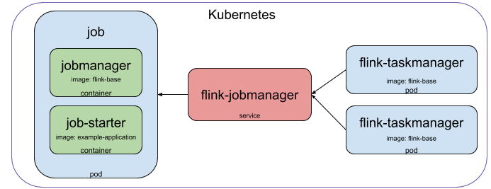

# Apache Flink on Kubernetes
Simple example project to run Flink applications on Kubernetes


## How does it work
We have 3 kubernetes resources:
 * A service
 * A flink-job deployment
 * A taskmanager deployment
 
 

### Jobmanager service
 The jobmanager service does nothing more than allowing us and the taskmanagers to find the jobmanager (think proxy).
 
### Taskmanager 
 The taskmanager deployment describes how a taskmanager looks, we can easily scale to multiple taskmanager this way using the [replicaset](https://kubernetes.io/docs/concepts/workloads/controllers/replicaset/) functionality of kubernetes. It uses the `flink-base` docker image.

### Flink-job
 The flink-job deployment has 2 containers.
 * flink jobmanager
 * job starter
 
 The jobmanager container starts the flink cluster and all taskmanagers connect (via the service) to this container. It uses the `flink-base` docker image. 
 
 The job starter container is only responsible for submitting the job. It uses a docker image based on the `flink-base` image but it also contains a jar with the flink job you want to run (generally this would contain your code). If you were to update your application you would only update this image (see [example-application](/docker/example-application))


## Building the docker images
There are two docker images. [flink-base](/docker/flink-base) and [example-application](/docker/example-application). Because the example-application uses the flink-base image you might need to edit the [Dockerfile](/docker/example-application/Dockerfile) to point to the correct image.


### Kubernetes on Google Cloud Platform example
For instance if you are building for kubernetes on the google cloud you might do something like:


```
docker build /docker/flink-base -t eu.gcr.io/my-google-project/flink-base:1.0
docker push eu.gcr.io/my-google-project/flink-base:1.0
```
In the example-application [Dockerfile](/docker/example-application/Dockerfile) change

```
FROM flink-base:1.0
```

to 

```
FROM eu.gcr.io/my-google-project/flink-base:1.0
```

and run

```
docker build /docker/example-application -t eu.gcr.io/my-google-project/example-application:1.0
docker push eu.gcr.io/my-google-project/example-application:1.0
```
## Kubernetes resource templates

Depending on where you pushed the docker images to you might need to edit the templates. In case of the Google Cloud Platform example I would have to change:

``` 
image: example-application:1.0
```

to 

```
image: eu.gcr.io/my-google-project/example-application:1.0
```

in the template files and then run:

```
kubectl apply -f kubernetes/
```

To use more taskmanagers either change `replicas: 1` to `replicas: 5` in [taskmanager.yaml](/kubernetes/taskmanager.yaml) or execute:

```
kubectl scale deploy/flink-taskmanager --replicas 5
```
